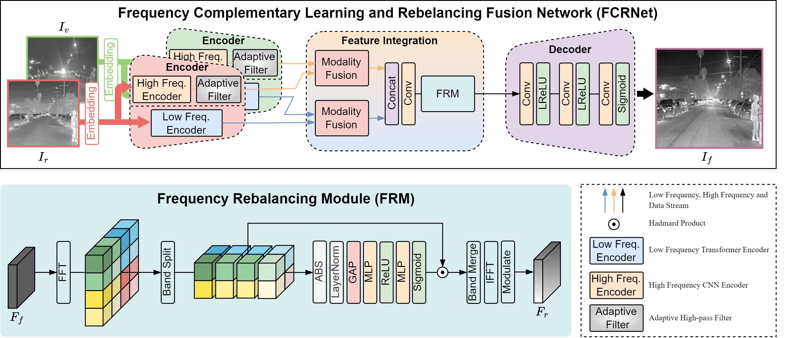

# Rethinking the CNN-Transformer Hybrid Architecture for Infrared and Visible Image Fusion from a Frequency Perspective
This is the official implementation of the **FCRNet** model proposed in the paper (Rethinking the CNN-Transformer Hybrid Architecture for Infrared and Visible Image Fusion from a Frequency Perspective) with Pytorch.

The work will soon be open source
